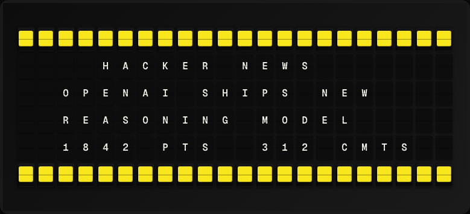

# Hacker News Plugin

Display the top Hacker News story title and score on your board.



**→ [Setup Guide](./docs/SETUP.md)**

## Overview

The Hacker News plugin fetches top stories from the official HN Firebase API. It shows the title, score, and comment count of the highest-ranked story. No API key required.

## Template Variables

| Variable | Description | Example |
|---|---|---|
| `hacker_news.title` | Story title (truncated to fit board) | `Ask HN: What are you` |
| `hacker_news.score` | Story score (upvotes) | `1234` |
| `hacker_news.comments` | Number of comments | `342` |
| `hacker_news.author` | Story author username | `pg` |

## Example Templates

```
HACKER NEWS
{{hacker_news.title}}

Score: {{hacker_news.score}}
Comments: {{hacker_news.comments}}

```

## Configuration

| Setting | Name | Description | Required |
|---|---|---|---|
| `story_index` | Story Position | Which story to display (1 = top story, 2 = second, etc.). | No |
| `feed` | Feed | Which HN feed to display. | No |

## Features

- Official HN Firebase API
- Configurable story position (top 30)
- Multiple feeds (top, best, new, ask, show)
- Score and comment count
- No API key required

## Author

FiestaBoard Team
